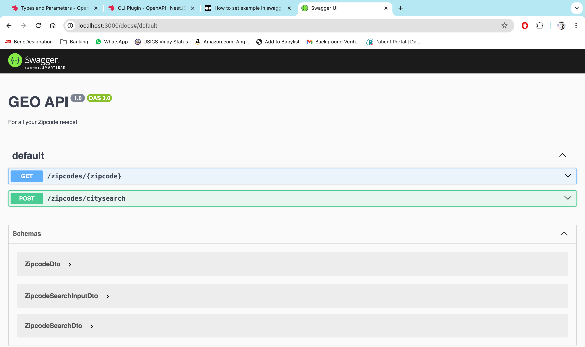
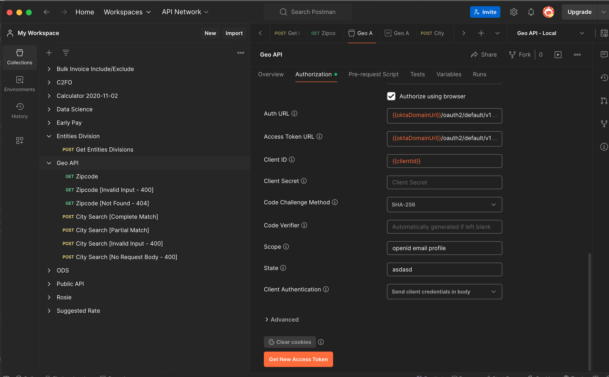
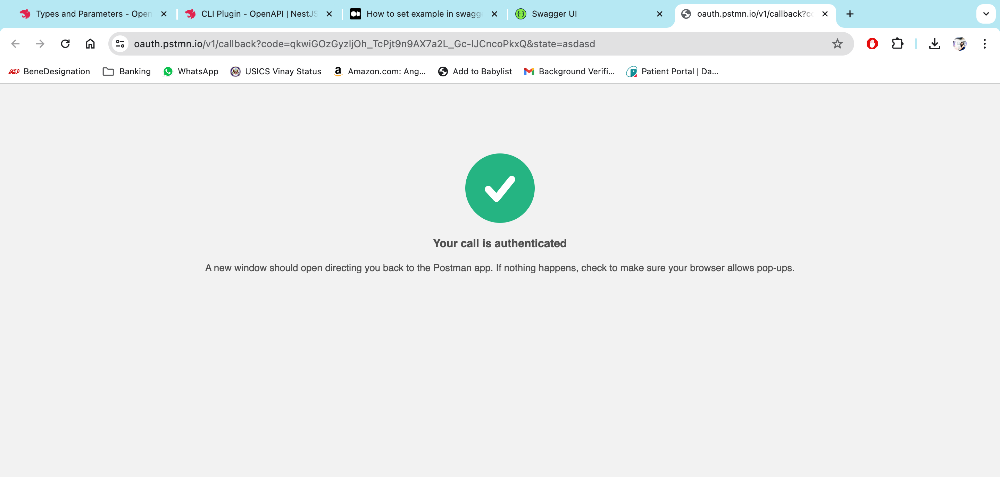
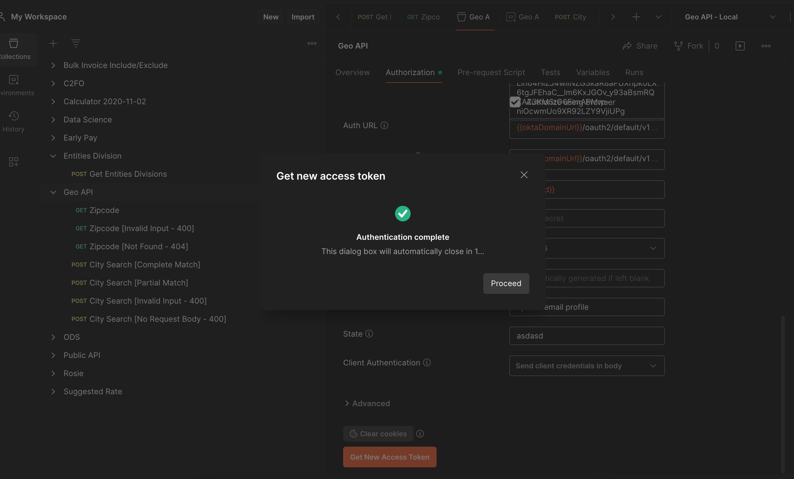
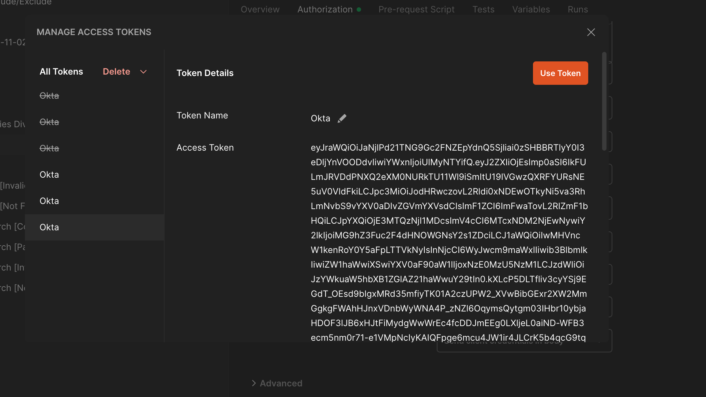
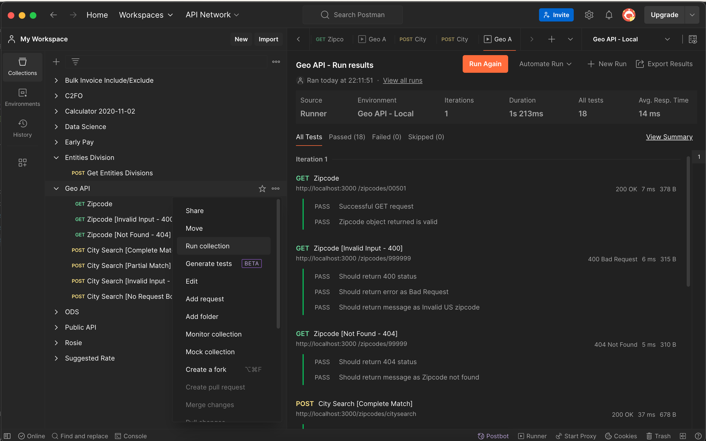

<p align="center">
  
</p>

  <p align="center">GEO-API, the only API you will ever need for managing Zipcodes</p>

## Table of Contents

- [Table of Contents](#table-of-contents)
- [Overview](#overview)
- [Getting Started](#getting-started)
- [API Docs](#api-docs)
- [Testing the API](#testing-the-api)

## Overview

The GEO-API provides two endpoints that provide convenient ways to retrieve information about zipcodes and search for zipcodes based on city names.

- GET /zipcodes/:zipcode

  - Allows you to retrieve information about a specific zipcode. It returns details such as the city, state, latitude, and longitude associated with the provided zipcode.

- POST /zipcodes/citysearch
  - Allows you to search for zipcodes based on a city name. You can provide the city name as a parameter in the request body, and the API will return a list of zipcodes associated with that city (if the city is not found, it will attempt to find the closest matches).
  - :warning: Note that this endpoint is setup to return only the top 3 best matching zipcodes. :warning:

## Getting Started

1. Install Dependencies
   ```zsh
   npm install
   ```
2. Start the server
   ```zsh
   npm run start
   ```

## API Docs

1. Start the app by running `npm run start`
2. After the app has started, go to http://localhost:3000/docs to check out the API docs
   - Note that the `Try it out` feature will not work because the API routes are guarded by Okta auth. So in order to actually try the endpoints out, please check out the [Testing the API](#testing-the-api) section

- 

## Testing the API

There are two ways to test the application:

1. Unit Tests
   - To run unit tests, run the following command: `npm run test`
2. Postman Test Suite
   - The API comes with a built in postman test suite that tests all the various scenarios for both of the endpoints (GET /zipcode and POST /citysearch) such as 400, 404s etc
     - ⚠️ WARNING: The test suite was created with Postman Desktop application in mind, it will not work for Postman Web clients so please use the Desktop app ⚠️ 
   - Download the Postman collection along with the Postman environment from [here](/postman/) and import them in Postman
   - After you finish the import, point your local environment to the downloaded one (`Geo API - Local`)
   - Click on the GEO API collection, go to Authorization tab and scroll down to the end and click on `Get New Access Token` button. ⚠️ When you click on Get New Access Token, Postman will open a new browser window requesting Username and Password. I created a test account for you to use in order to be able to access this API, please use the following credentials:
     - Username: `testuser@test.com`
     - Password: `1nsight1`
     - 
   - Postman should then automatically open a Browser window and begin the authentication process. Ideally, you shouldn't have to do anything after -- it should finish authenticating and redirect back to Postman app where you are then provided the option to click on `Use Token` for the Okta token which you should click.
     - 
     - 
     - 
   - That's it! Then, all you have to do is select the `Run collection` to execute all the unit tests
     - 
